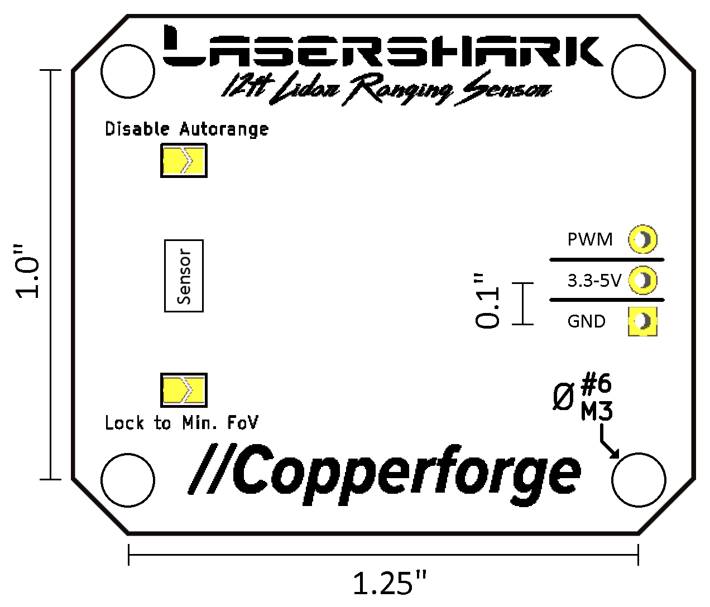

Lasershark 12ft Laser Rangefinder
=================================

Product ID: Cu//2A21

.. note:: See also the shop page for this product: `link <https://shop.copperforge.cc/products/2a21>`__

The Lasershark 12ft Ranging Sensor is a state-of-the-art Time-of-Flight laser ranging sensor, which offers precise ranging up to 12ft in an easy-to-use form factor and interface. Onboard firmware allows students to interact with this complex sensor with only a standard 3-wire 0.1" pitch "PWM" cable and minimal programming.

Files/Links
-----------------

- `Lasershark Cu//2A21 Product Flyer <https://drive.google.com/file/d/1KnewXr3yR99sqZ6ItXE7vhCQxA3aYXkP/view>`_
- `Lasershark Shop Page <https://shop.copperforge.cc/products/2a21>`_

Background
----------

LIDAR (LIght Detection And Ranging) sensors are a variety of rangefinder seeing increasing use in competition robotics. The Lasershark (Cu//2A21) is an example of a single-dimension (1D) LIDAR sensor.

1D LIDAR sensors works much like common ultrasonic sensors - they measure the distance to the nearest object which is more or less along a line in front of it. These sensors can often be more reliable than ultrasonics, as they have narrower beam profiles. This means that they are less susceptible to interference from other nearby objects.

Similarly to an ultrasonic, this sensor uses time-of-flight measurement techniques. Distance is calculated by measuring the round trip time between a laser pulse and its return to the sensor. This method is more accurate than calculating the distance based on reflected light intensity, which is the method typically used for infrared proximity sensors.

Sensor Details
--------------

|Lasershark Mechanical Drawing|

Electrical connection
^^^^^^^^^^^^^^^^^^^^^

.. warning:: Always consult the technical specifications of the control system you are using *before* wiring the sensor, to ensure that the correct pins are connected.  Failure to do so can result in damage to the sensor or the control system.

The Lasershark has three pins to connect, as seen in the image above: signal ("PWM" or ~), power ("3.3V-5V" or +), and ground ("GND" or |ground|).

The power and ground pins are used to power the sensor. The signal pin is the pin on which the PWM output signal is actually measured.

Mechanical mounting
^^^^^^^^^^^^^^^^^^^

.. warning:: If mounting to conductive surfaces, use the supplied acrylic backplane to avoid any cross-conduction which may damage the sensor, or use plastic standoffs and fasteners.

As seen in the image above, the Lasershark mounts using a 1.25" by 1" bolt pattern, compatible with #6/M3 bolts or smaller.

.. todo:: Add content about the PWM signal itself

Software
--------

.. note:: For API documentation and detailed information about LibCu, please see :ref:`libcu-header`.

Using LibCu, it takes just two lines of code to receive data from the sensor:

.. tabs::

    .. code-tab:: c++

        libcu::Lasershark * shark = new Lasershark(DigitalInput(0));
        double distance = shark.GetDistanceInches();

    .. code-tab:: java

        Lasershark shark = new Lasershark(new DigitalInput(0));
        double distance = shark.getDistanceInches();

Full API documentation is available on the LibCu resource page.

.. |ground| unicode:: 0x23DA
